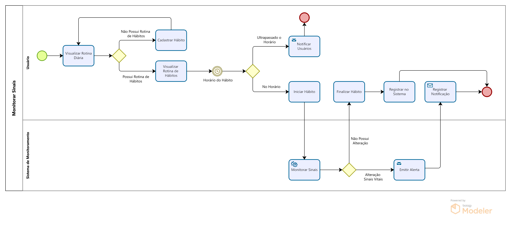
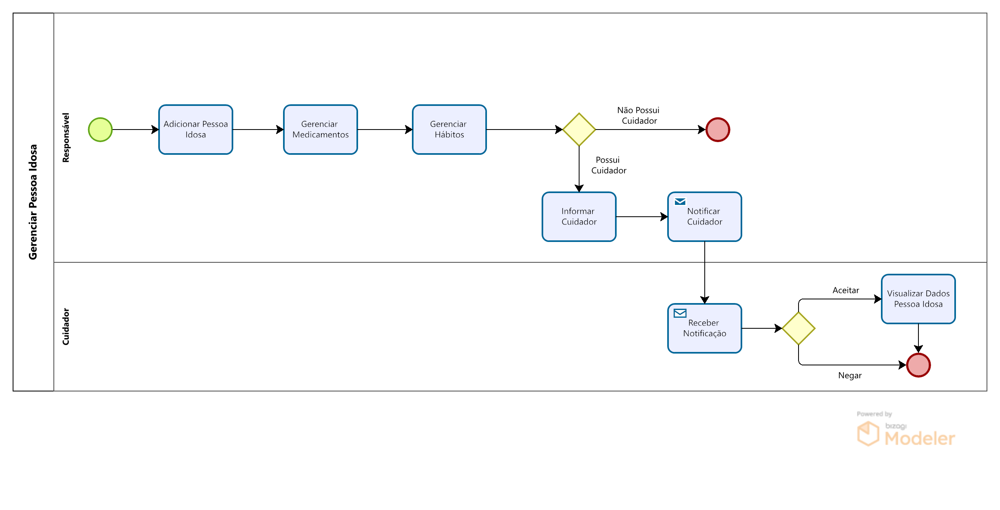

# Diagrama de BPMN: Monitorar Sinais

## 1. Descrição

Diagrama de BPMN relacionado ao fluxo de monitoramento de sinais vitais durante a execução de rotinas de hábitos.

# Diagrama de BPMN: Gerenciar Pessoa Idosa

## 2. Descrição

Diagrama de BPMN do cadastro de pessoas idosas por parte do responsável.

