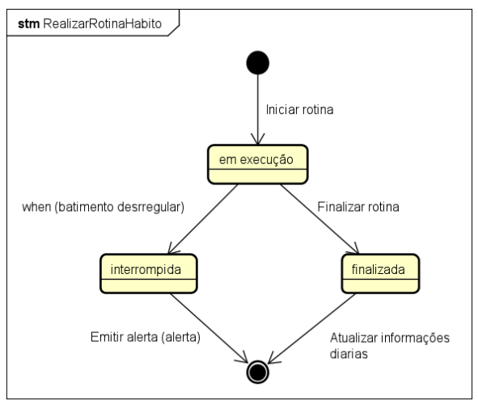
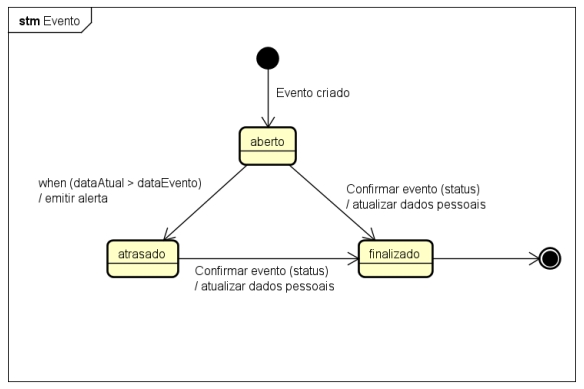
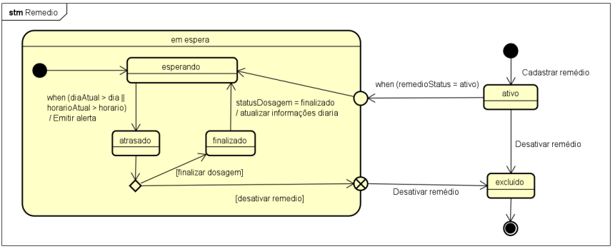

# Diagrama de Estado: Realizar Hábito

## 1. Descrição

Diagrama de estado da execução de um hábito.

# Diagrama de Estado: Evento

## 2. Descrição

Diagrama de estado da execução de um evento.

# Diagrama de Estado: Medicamento

## 3. Descrição

Diagrama de estado de medicamento.

